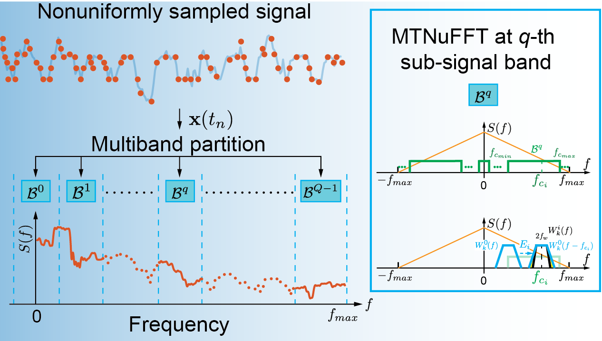

<div align="center">

# Multiband-Multitaper Nonuniform Fast Fourier Transform (M<sup>2</sup>NuFFT)

[](https://arxiv.org/abs/2407.01943) [](LICENSE)



</div>

## Introduction

__M<sup>2</sup>NuFFT__ is a computationally efficient suboptimal power spectrum estimator for fast exploration of nonuniformly sampled time series.  This is the code repository for the paper pre-print [(Cui 2024)](https://arxiv.org/abs/2407.01943).

* Introduces M<sup>2</sup>NuFFT for fast spectrum estimation of nonuniform time series.
* Reduces complexity from $\mathcal{O}(N^4)$ to $\mathcal{O}(N \log N + N \log(1/\varepsilon))$ using multiband-multitaper approach.
* Bias and variance bounds match optimal Bronez GPSS; suboptimality quantified.
* Achieves 2–3 orders faster computation than GPSS with competitive accuracy.
* Extends Thomson _F_-test for periodicity detection in nonuniformly sampled data.

## Getting Started

1. Download and install [Chronux](https://github.com/jiecui/chronux) computational toolbox. Please use [this fork](https://github.com/jiecui/chronux) of `Chronux` as some of the original codes need to be modified for compatibility.

1. Download and install [M<sup>2</sup>NuFFT](https://github.com/jiecui/m2nufft) package.

## Build and Test

1. Error analysis of MTNUFFT method

   ```mtnufft_error_analysis.m```

1. Speed analysis of MTNUFFT method

   ```mtnufft_speed_analysis.m```

1. Analysis of example impedance signal

   ```imp_example_analysis.m```

## Contribute

  [Laboratory of Bioelectronics Neurophysiology and Engineering at Mayo Clinic](https://www.mayo.edu/research/labs/bioelectronics-neurophysiology-engineering/overview)

## References

* __J. Cui__, B. H. Brinkmann, G. A. Worrell, _A fast multitaper power spectrum estimation in nonuniformly sampled time series_, Digital Signal Processing, [Dec 18:105834](https://www.sciencedirect.com/science/article/abs/pii/S1051200425008504), 2025, [[arXiv, 5704101]](https://arxiv.org/abs/2407.01943), 2025 [[PDF]](./docs/m2nufft_arxiv_v4.pdf).
